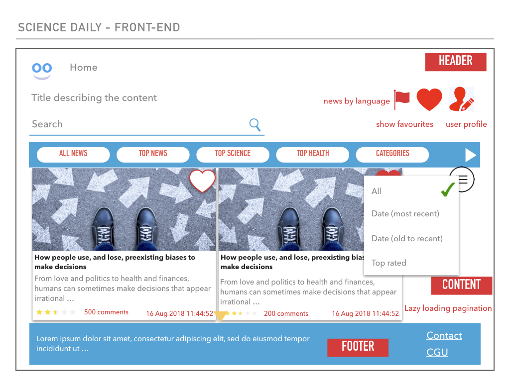
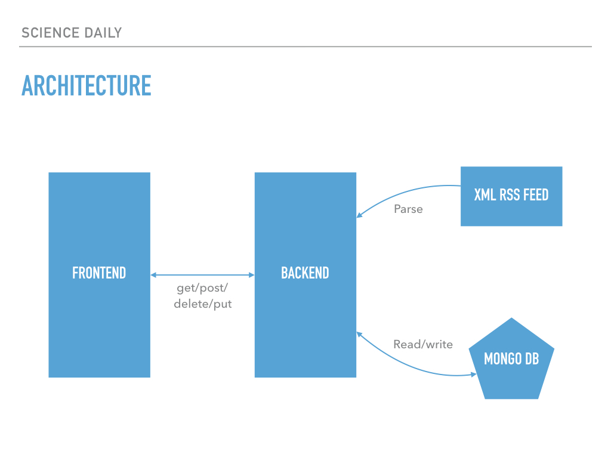

# Science Daily News App

## Presentation 

This application is a benchmark project to test backend (rust, node-koa, elixir-erlang-phoenix, haskell-yesod) & frontend (react, elm) technologies.

## Implementation phases

https://github.com/helabenkhalfallah/science-daily-app/projects

## Application

## Architecture 

## Needed services :

- get topics : all news, top news, top science, top health, top technology, top environment, top society, strange & offbeat, most popular, categories
- get news by topic
- get categories : health, technology, environment, society, quirky.
- get subcategories by category
- get news by category and subcategory
- oder by : date (most recent -> old), date (old -> most recent), top rated
- search
- news by language (default en)
- user account : login/register/forget password/edit
- add/remove from favourite for current user
- get all favourite news for current user
- submit / update a review

Notes :

- First step : without pagination
- Second step : with pagination
